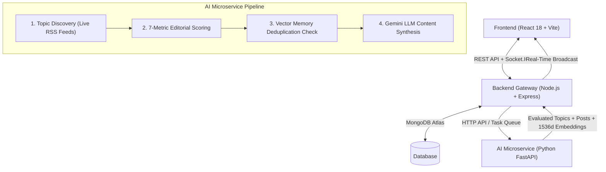

# ABTalks — Autonomous AI Creator & Content Engine 🚀


**ABTalks** is an enterprise-grade, self-directing multi-agent AI platform. It continuously crawls multi-source tech news, evaluates topic quality via a 7-dimensional editorial scoring matrix, checks long-term vector memory to eliminate semantic duplicates, and synthesizes persona-tuned posts using Google Gemini LLM.

---

## 🏗️ Architecture & Data Flow



---

## ✨ Key Features

- **🌐 Live Multi-Source Topic Discovery**: Aggregates AI and tech news from live RSS feeds including TechCrunch AI, VentureBeat, MIT Tech Review, and HackerNews.
- **📊 7-Dimensional Editorial Scoring Matrix**:
  - **Novelty** (20%)
  - **Importance** (20%)
  - **Trend** (15%)
  - **Technical Depth** (15%)
  - **Audience Interest** (15%)
  - **Credibility** (10%)
  - **Freshness** (5%)
  - *Threshold*: Topics must score **≥ 7.50 / 10.0** to be approved.
- **🧠 Vector Memory & Cosine Deduplication**: Generates 1536-dimensional embeddings for candidate topics and flags duplicates with Cosine Similarity **> 0.82**.
- **🤖 Persona Voice Customization**: Fine-tune AI creators by domain, tone, target audience, format preferences, and emoji usage.
- **⚡ Real-Time Socket.IO Synchronization**: Pushes live topic evaluation and post publishing events directly to the frontend.
- **⏱️ BullMQ Background Scheduler**: Automated 30-minute interval task processing.

---

## 📂 Repository Structure

```text
ABTalks/
├── frontend/             # React 18 + Vite + Tailwind CSS Dashboard UI
│   ├── src/
│   │   ├── components/   # Reusable UI components
│   │   ├── context/      # Socket.IO & global state contexts
│   │   ├── pages/        # Dashboard, PersonaProfile, TopicDiscovery, Feed, etc.
│   │   └── services/     # Axios API client
│   └── package.json
│
├── backend/              # Node.js + Express + TypeScript API Gateway
│   ├── src/
│   │   ├── config/       # Database, Logger, & Environment settings
│   │   ├── controllers/  # Agent, Persona, Topic, Post, & Memory controllers
│   │   ├── models/       # Mongoose schemas (Persona, Topic, Post, Memory, Log)
│   │   ├── queue/        # BullMQ queue worker & Redis connection
│   │   ├── routes/       # Express REST API routes
│   │   └── server.ts     # Server entrypoint
│   └── package.json
│
└── ai-service/           # Python FastAPI Multi-Agent Engine
    ├── app/
    │   ├── agents/       # LangChain / Graph Pipeline builder
    │   ├── discovery/    # Feed parser & RSS crawler
    │   ├── editorial/    # 7-Dimensional scoring matrix engine
    │   ├── llm/          # Google Gemini API client
    │   └── memory/       # Cosine vector similarity memory manager
    ├── main.py           # FastAPI entrypoint
    └── requirements.txt
```

---

## 🚀 Quick Start Guide

### Prerequisites
- **Node.js** v18+
- **Python** v3.10+
- **MongoDB** (Local instance or MongoDB Atlas URI)
- **Redis** (Local instance or Redis cloud URI, optional fallback included)

---

### Step 1: Install Dependencies

#### 1. Backend Gateway
```bash
cd backend
npm install
```

#### 2. AI Microservice
```bash
cd ai-service
pip install -r requirements.txt
```

#### 3. Frontend Dashboard
```bash
cd frontend
npm install
```

---

## 🖥️ Running the Application (3 Terminals)

Open **3 separate terminal windows** at the root of the project:

### Terminal 1: Backend API Gateway
```bash
cd backend
npm run dev
```
> Running on `http://localhost:5000`

### Terminal 2: Python AI Microservice
```bash
cd ai-service
python main.py
```
> Running on `http://localhost:8000`

### Terminal 3: Frontend Dashboard
```bash
cd frontend
npm run dev
```
> Running on `http://localhost:5173`

---

## 💻 Manual User Operation Guide

1. Open **[http://localhost:5173](http://localhost:5173)** in your browser.
2. Navigate to **Persona Profile** (`/persona`) to customize your AI's voice, domain, and target audience.
3. On the **Dashboard**, click the **`Initialize Persona Worker`** (▶️) button to manually trigger a topic crawl & generation cycle.
4. Explore the views:
   - **Live Feed** (`/feed`): Published AI posts with editorial rationale & source links.
   - **Topic Discovery** (`/topics`): Aggregated RSS candidate topics.
   - **Editorial Decisions** (`/editorial`): Detailed 7-metric score breakdown.
   - **Memory Viewer** (`/memory`): 1536-dim vector memory logs.
   - **Scheduler Logs** (`/scheduler`): Background worker execution logs.

---

## 🌐 API Reference

| Endpoint | Method | Description |
| :--- | :--- | :--- |
| `GET /health` | `GET` | Backend service health check |
| `POST /api/auth/register` | `POST` | User registration |
| `POST /api/auth/login` | `POST` | User authentication |
| `POST /api/agent/init` | `POST` | Trigger autonomous AI discovery & post cycle |
| `GET /api/agent/feed` | `GET` | Retrieve published AI posts feed |
| `GET /api/persona` | `GET` | Get active AI persona configurations |
| `POST /api/persona` | `POST` | Create or update AI persona settings |
| `GET /api/topics` | `GET` | Get evaluated topic candidates & scores |
| `GET /api/posts` | `GET` | Fetch all generated posts |
| `GET /api/memory` | `GET` | Get vector memory similarity logs |
| `GET /api/scheduler/logs` | `GET` | Fetch BullMQ background task logs |

---

## 📄 License
Distributed under the MIT License.
